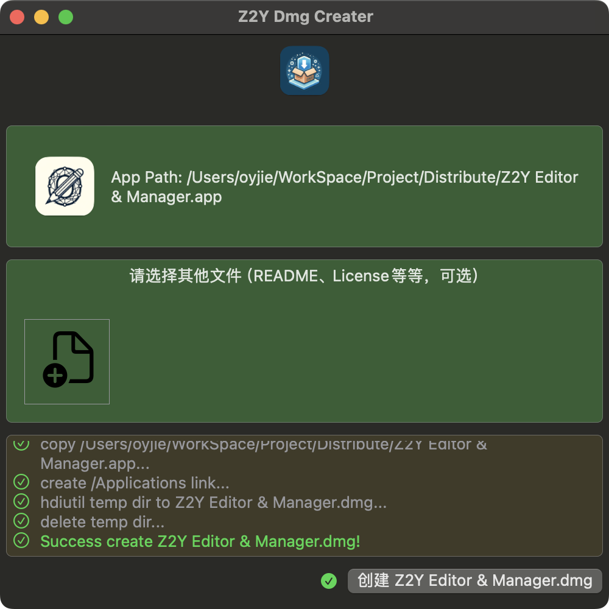
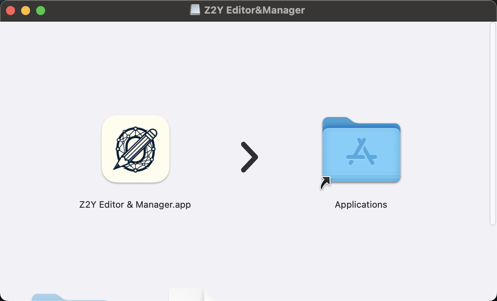

#  Z2Y 打包器 for DMG

A packager that bundles executable app files into installation-guided DMG files.

一款将可执行 app 文件打包成安装指导的 DMG 文件的打包器。

Background: Developed a few apps intended for distribution outside the App Store environment. To package them into DMG files, I found that the existing tools on the market were quite expensive (over $24). So, I spent a few minutes writing the core functionality:

缘起： 开发了个几个 App 某些想在非 App Store 环境分发，需要打包成 DMG 文件，发现市面上的打包工具都挺贵（$24+），于是花几分钟写了核心功能：

```swift
public static func createDmg(appURL: URL, dmgDirURL: URL) throws -> URL {
    let appName = appURL.lastPathComponent.dropLast(appURL.pathExtension.count)
    let dmgURL = dmgDirURL.appendingPathComponent("\(appName).dmg")
    // 使用 hdiutil 命令来创建 DMG 文件
    let process = Process()
    process.executableURL = URL(fileURLWithPath: "/usr/bin/hdiutil")
    process.arguments = ["create", "-volname", "\(SystemUtil.localizedString("PleaseDrop")) \(appURL.lastPathComponent) \(SystemUtil.localizedString("to")) Applications \(SystemUtil.localizedString("Floder"))", "-srcfolder", appURL.deletingLastPathComponent().path, "-ov", "-format", "UDZO", dmgURL.path]
    try process.run()
    process.waitUntilExit()
    return dmgURL
}
```

Spent one hour refining the workflow interface, also explored open-source packages to adjust the background and used AI-generated application icons. The overall development cost and technical barriers are low, so decided to open-source it.

花 1 个小时调整了流程界面，顺带寻找了开源的包调整背景，AI 生成应用 icon 等，整体开发成本和技术门槛较低，于是开源出来。

## Licence

随便用，做你想做的。

Use it freely, do what you want to do.

## 示范截图（Example）





## Coffee

如果觉得不错，请我喝一杯 Coffee 吧！[【前往】](https://www.buymeacoffee.com/petterobam)

If you like it, buy me a cup of coffee！ [Go](https://www.buymeacoffee.com/petterobam)


